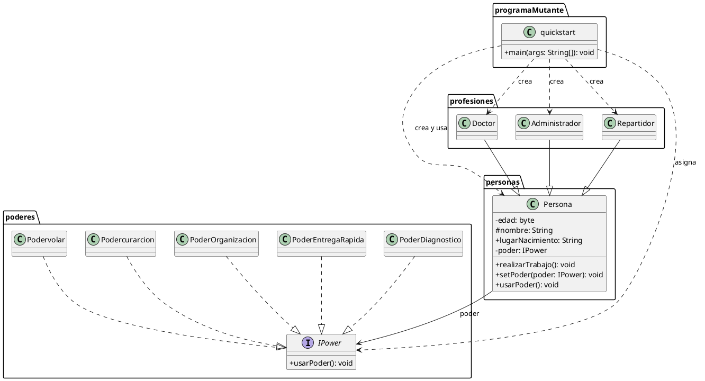

# Practica de Programacion Orientada a Objetos

Programa Java de consola que representa personas con distintas profesiones y poderes. Demuestra herencia, polimorfismo, interfaces, encapsulamiento y asociaciones entre objetos.

## Funcionamiento

El programa crea personas con las profesiones de doctor, administrador y repartidor. Cada profesion puede realizar su trabajo y calcular el monto obtenido segun sus consultas, trabajos o entregas. Tambien se crean profesionales aleatorios, se les asigna un poder y se usa ese poder mediante la interfaz `IPower`.

La clase de inicio es `programaMutante.quickstart`.

## Estructura

```text
src/
  personas/          Clase base Persona
  profesiones/       Especializaciones profesionales
  poderes/           Interfaz y poderes concretos
  programaMutante/   Punto de entrada del programa
docs/
  diagrama-clases.puml
```

## Clases

| Paquete | Clase | Responsabilidad |
| --- | --- | --- |
| `personas` | `Persona` | Clase base con nombre, edad y un poder opcional. |
| `profesiones` | `Doctor` | Atiende pacientes, guarda especialidad y calcula cobros por consulta. |
| `profesiones` | `Administrador` | Administra un area y calcula el pago por trabajos realizados. |
| `profesiones` | `Repartidor` | Reparte pedidos, registra un vehiculo y calcula el cobro por entrega. |
| `poderes` | `IPower` | Define el contrato `usarPoder()`. |
| `poderes` | `PoderDiagnostico`, `PoderEntregaRapida`, `PoderOrganizacion`, `Podercurarcion`, `Podervolar` | Implementan los poderes disponibles. |
| `programaMutante` | `quickstart` | Contiene `main` y ejecuta los ejemplos del programa. |

## Compilar y ejecutar

Desde la raiz del proyecto, en PowerShell:

```powershell
javac -d bin (Get-ChildItem -Path src -Recurse -Filter *.java | ForEach-Object { $_.FullName })
java -cp bin programaMutante.quickstart
```

## Diagrama de clases (PlantUML)

El archivo fuente del diagrama tambien esta disponible en `docs/diagrama-clases.puml`.

